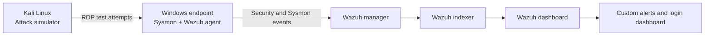

# SIEM Detection Lab

Build a small security operations environment that collects Windows telemetry in Wazuh, produces controlled failed and successful logons, detects suspicious authentication activity with a custom Wazuh rule, and visualises the results.

## Learning objectives

- Deploy Wazuh as a single-node SIEM.
- Install Sysmon and the Wazuh agent on a Windows endpoint.
- Collect Windows Security and Sysmon operational logs.
- Generate repeatable authentication telemetry from Kali Linux.
- Write, test, deploy, and tune a Wazuh rule.
- Build a dashboard comparing Event ID 4624 and 4625 activity.

## Architecture



## Safety boundaries

Use an isolated host-only or internal virtual network. Use a disposable Windows VM, a synthetic account such as `LAB\analyst`, and no reused password. Disable the test account and RDP when finished.

## Phase 1 — Deploy Wazuh

### Recommended VM layout

| VM | Suggested resources | Network |
|---|---:|---|
| Wazuh Ubuntu host | 4 vCPU, 8 GB RAM, 50 GB disk | NAT plus host-only |
| Windows endpoint | 2 vCPU, 4 GB RAM | Host-only |
| Kali Linux | 2 vCPU, 4 GB RAM | Host-only |

### Start the official Wazuh single-node Docker stack

Use the current version shown in the official Wazuh Docker documentation rather than copying an old version number from this repository.

```bash
git clone https://github.com/wazuh/wazuh-docker.git -b <CURRENT_WAZUH_TAG>
cd wazuh-docker/single-node
docker compose -f generate-indexer-certs.yml run --rm generator
docker compose up -d
docker compose ps
```

Open `https://<WAZUH_HOST_IP>` and immediately replace default credentials. Record the Wazuh manager address, not the dashboard address, for agent enrolment.

### Install and enrol the Windows agent

In the Wazuh dashboard, open **Agents → Deploy new agent**, select Windows, enter the manager address and copy the generated installation command. Confirm the endpoint becomes **Active** before continuing.

### Install Sysmon

Download Sysmon from Microsoft Sysinternals. Copy [`config/sysmon-config.xml`](./config/sysmon-config.xml) to the endpoint and run an elevated PowerShell prompt:

```powershell
.\Sysmon64.exe -accepteula -i .\sysmon-config.xml
Get-Service Sysmon64
Get-WinEvent -LogName "Microsoft-Windows-Sysmon/Operational" -MaxEvents 5
```

Apply later configuration changes with:

```powershell
.\Sysmon64.exe -c .\sysmon-config.xml
```

### Collect Security and Sysmon channels

Add event-channel collection blocks inside the Wazuh agent's `<ossec_config>` element, then restart the agent:

```powershell
Restart-Service WazuhSvc
```

Collect at least Windows Security Event IDs 4624, 4625, 4648, 4672 and 4688, plus the full `Microsoft-Windows-Sysmon/Operational` channel.

Validate ingestion by running:

```powershell
whoami
Start-Process notepad.exe
```

In Wazuh Discover, filter for:

```text
agent.name:"<WINDOWS_HOSTNAME>" AND (data.win.system.eventID:"1" OR data.win.system.eventID:"4624")
```

## Phase 2 — Generate controlled authentication events

### Prepare the Windows endpoint

Create a non-privileged test account and permit Remote Desktop only on the isolated lab network:

```powershell
$Password = Read-Host "Enter a unique lab-only password" -AsSecureString
New-LocalUser -Name "analyst" -Password $Password -Description "Disposable SIEM lab user"
Add-LocalGroupMember -Group "Remote Desktop Users" -Member "analyst"
Set-ItemProperty "HKLM:\System\CurrentControlSet\Control\Terminal Server" -Name fDenyTSConnections -Value 0
Enable-NetFirewallRule -DisplayGroup "Remote Desktop"
```

### Simulate a small password spray from Kali

Create three known-wrong passwords in `lab-passwords.txt`. Keep the attempt count intentionally low.

```bash
printf '%s\n' 'Wrong-Lab-01!' 'Wrong-Lab-02!' 'Wrong-Lab-03!' > lab-passwords.txt

while read -r password; do
  timeout 12 xfreerdp /v:<WINDOWS_IP> /u:analyst /p:"$password" /cert:ignore /auth-only || true
  sleep 5
done < lab-passwords.txt
```

Then perform one authorised successful RDP logon using the real lab password. Expected Windows Security events:

- **4625** — failed logon.
- **4624** — successful logon.
- Logon Type **10** normally represents RemoteInteractive/RDP activity.

## Phase 3 — Detection engineering

Copy [`config/wazuh-local-rules.xml`](./config/wazuh-local-rules.xml) into `/var/ossec/etc/rules/` on the manager and merge it with existing local rules if required.

Test before deploying:

```bash
sudo /var/ossec/bin/wazuh-logtest
```

After validation:

```bash
sudo systemctl restart wazuh-manager
# Docker deployment:
docker compose restart wazuh.manager
```

### Detection logic

```text
WHEN Windows Event ID = 4625
GROUP by source IP
COUNT >= 3
WITHIN 120 seconds
THEN raise level 10 alert mapped to MITRE ATT&CK T1110
```

### Tuning questions

- Is the source a vulnerability scanner, jump host, VPN gateway, or user workstation?
- Are many usernames targeted from one IP, or one username from many IPs?
- Is the activity followed by a successful logon?
- Does the source normally access this host at this time?
- Should service accounts, health checks, or approved scanners be allowlisted?

## Phase 4 — Dashboard

Create a saved query for the Windows endpoint:

```text
data.win.system.eventID:("4624" OR "4625")
```

Build a vertical bar or area chart:

- **X-axis:** `timestamp`, 5-minute interval.
- **Split series / terms:** `data.win.system.eventID`.
- **Metric:** event count.
- Add filters for the endpoint and interactive logon types.
- Rename series `4624 — Successful` and `4625 — Failed`.

Add supporting panels:

1. Failed logons by source IP.
2. Failed logons by target username.
3. Logon type distribution.
4. Custom rule alerts over time.
5. Table containing timestamp, source IP, username, workstation, and failure reason.

## Validation checklist

- [ ] Wazuh central containers are healthy.
- [ ] Windows agent is active.
- [ ] Sysmon Event ID 1 is visible.
- [ ] Security Event ID 4624 and 4625 are visible.
- [ ] Three controlled failures trigger the custom rule.
- [ ] One successful logon appears on the dashboard.
- [ ] Screenshots contain no passwords, public IPs, tokens, or personal data.
- [ ] Test account and RDP exposure are removed after the exercise.

## Interview narrative

“I deployed Wazuh, onboarded a Windows endpoint, and configured Sysmon and Security event collection. I generated a controlled RDP password-spray pattern from Kali, wrote a correlation rule for repeated 4625 events, tested and tuned it, and built a dashboard that compares successful and failed logons. I can explain the detection’s fields, thresholds, blind spots, and false-positive controls rather than relying only on default alerts.”
