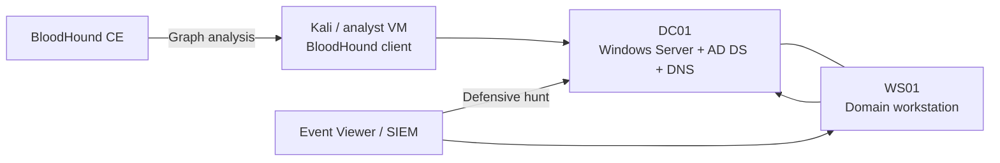

# Active Directory Attack & Defence Lab

Deploy a small Windows domain, deliberately introduce a limited attack path, map it with BloodHound, emulate Kerberoasting and pass-the-hash using synthetic lab credentials, and investigate the resulting Windows telemetry.

> **Strict scope:** Use only disposable VMs on an isolated network. Do not use the procedures or tools against any domain you do not own and explicitly control. Destroy the snapshots or rotate all credentials after the exercise.

## Architecture



## Build specification

| System | Purpose | Example |
|---|---|---|
| DC01 | Domain controller and DNS | `10.10.10.10` |
| WS01 | Domain-joined workstation | `10.10.10.20` |
| Kali | Collection and testing | `10.10.10.30` |
| Domain | Synthetic namespace | `LAB.LOCAL` |

Use host-only networking and set the workstation and Kali DNS server to DC01.

## Phase 1 — Deploy the domain

On Windows Server, set a static IP, rename the host to `DC01`, then run elevated PowerShell:

```powershell
Install-WindowsFeature AD-Domain-Services -IncludeManagementTools
Install-ADDSForest -DomainName "lab.local" -DomainNetbiosName "LAB" -InstallDNS
```

Supply the DSRM password interactively. After restart, copy and run [`scripts/New-LabDomain.ps1`](./scripts/New-LabDomain.ps1). It creates synthetic users, a service account, a test SPN, and a deliberately delegated group relationship for BloodHound analysis.

Join WS01 to the domain:

```powershell
Add-Computer -DomainName lab.local -Credential LAB\Administrator -Restart
```

## Phase 2 — BloodHound attack-path analysis

Install BloodHound Community Edition using its current official deployment method. From a domain-joined collection host, run the current SharpHound collector with least privilege:

```powershell
.\SharpHound.exe -c All --outputdirectory C:\BloodHoundData
```

Import the resulting ZIP into BloodHound. Begin with these queries:

- Find all Domain Admins.
- Shortest paths to Domain Admins.
- Kerberoastable users.
- Computers where domain users have local administrator rights.
- Principals with `GenericAll`, `GenericWrite`, `WriteDACL`, or group-control edges.

Document each risky edge as: **source principal → permission → target → abuse condition → remediation**.

## Phase 3 — Controlled Kerberoasting exercise

Kerberoasting requests a service ticket for an account with an SPN. The defensive value of the exercise is to observe unusually high ticket-request volume, legacy encryption use, unusual request sources, and offline cracking risk.

Confirm the synthetic service account has an SPN:

```powershell
setspn -Q HTTP/web.lab.local
```

From the authorised lab client, request the service ticket using an approved training utility. Do not upload the ticket, account material, or recovered password to GitHub. Rotate the service-account password immediately after testing.

### Hunt Kerberoasting

On the domain controller, inspect **Security Event ID 4769** and look for:

- Many service-ticket requests from one workstation in a short period.
- Requests for several SPNs by one user.
- RC4 encryption (`0x17`) where AES is expected.
- Service accounts with weak, old, or human-managed passwords.
- A workstation that does not normally administer the requested service.

```powershell
Get-WinEvent -FilterHashtable @{
  LogName='Security'
  Id=4769
  StartTime=(Get-Date).AddHours(-1)
} | Select-Object TimeCreated, Id, MachineName, Message
```

## Phase 4 — Controlled pass-the-hash exercise with Mimikatz

Mimikatz must run only on the disposable lab workstation while signed in as a lab administrator. Use a synthetic hash generated from a synthetic account and never commit it.

Inside the isolated lab:

```text
mimikatz.exe
privilege::debug
sekurlsa::logonpasswords
```

Record only that credential material was accessible; do not copy secrets into the repository. For a controlled pass-the-hash process, use placeholders:

```text
sekurlsa::pth /user:<LAB_USER> /domain:LAB /ntlm:<LAB_ONLY_NTLM_HASH> /run:cmd.exe
```

In the spawned process, access only a benign lab resource such as `\\DC01\LabShare`, then close the process and rotate the account password.

### Hunt pass-the-hash

| Event | Meaning | Suspicious pattern |
|---|---|---|
| 4624 | Successful logon | Logon Type 3 with NTLM from an unusual workstation. |
| 4648 | Explicit credentials | Process or account uses alternate credentials unexpectedly. |
| 4672 | Special privileges | Privileged token immediately follows a suspicious logon. |
| 4688 | Process creation | `cmd.exe`, remote admin tools, or unusual parent-child chain. |
| Sysmon 1 | Process creation | Full command line and hashes for the launched process. |
| Sysmon 10 | Process access | Unexpected access to `lsass.exe`. |
| 4776 | NTLM authentication | Domain controller validates credentials from an unusual source. |

Example correlation narrative:

```text
Sysmon 10 shows an unsigned process accessing lsass.exe.
Minutes later, 4624 Logon Type 3 using NTLM appears on DC01 from WS01.
4672 follows for the same Logon ID, and 5140/5145 shows access to a network share.
```

## Hardening and remediation

- Use group Managed Service Accounts where supported.
- Enforce long, random service-account passwords and frequent rotation.
- Prefer AES Kerberos encryption and reduce RC4 use.
- Limit local administrator rights and interactive logon for service accounts.
- Enable Credential Guard and LSASS protection where compatible.
- Restrict NTLM and monitor remaining dependencies.
- Apply tiered administration and privileged access workstations.
- Remove unnecessary SPNs and excessive ACL permissions.
- Forward domain-controller Security logs to a SIEM.

## Validation checklist

- [ ] Domain health checks pass (`dcdiag`, DNS, time synchronisation).
- [ ] Workstation is domain joined.
- [ ] Synthetic users and SPN are present.
- [ ] BloodHound identifies the deliberately created relationships.
- [ ] 4769 telemetry is captured during the Kerberoasting exercise.
- [ ] Sysmon 10 and Windows authentication telemetry are captured for the credential-access exercise.
- [ ] No credential, ticket, hash, or BloodHound ZIP is committed.
- [ ] Service-account and test-user passwords are rotated.
- [ ] Lab VMs are reverted or destroyed.

## Interview narrative

“I built a Windows domain, created realistic users, groups and an SPN-backed service account, and used BloodHound to explain privilege relationships. In an isolated sandbox I generated Kerberoasting and pass-the-hash telemetry, then hunted the activity using 4769, 4624, 4648, 4672, 4776, process creation, and Sysmon process-access events. I can discuss both the attack prerequisite and the control that breaks the path.”
