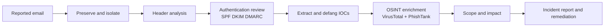

# Phishing Analysis Portfolio Project

Perform a complete phishing-email triage using a safely exported email, MXToolbox, VirusTotal, and PhishTank. The project demonstrates evidence handling, header analysis, indicator enrichment, impact assessment, and professional reporting.

## Workflow



## Safety and evidence handling

- Do not click links, open attachments, enable macros, reply, or call phone numbers in the message.
- Analyse from an isolated workstation or approved sandbox.
- Preserve the original message in `.eml` or `.msg` form according to organisational policy.
- Calculate hashes before and after handling.
- Record times in UTC.
- Do not upload confidential attachments or internal URLs to public services.
- Use the organisation’s private VirusTotal capability where data sensitivity requires it.

## Phase 1 — Intake and preservation

Create a case folder:

```text
case-YYYY-NNN/
├── evidence/
├── screenshots/
├── notes/
├── indicators.csv
└── incident-report.md
```

Record the reporter, time received, subject, displayed sender, recipient, delivery time, user actions, message ID, mailbox location, and SHA-256 of the exported message.

```powershell
Get-FileHash .\suspected-phish.eml -Algorithm SHA256
```

## Phase 2 — Header analysis with MXToolbox

Export the **full raw headers**, not the shortened display view. Paste only approved or sanitised header content into MXToolbox Header Analyzer.

Trace `Received:` headers from bottom to top. The earliest trustworthy hop normally identifies where the message entered the mail flow. Do not automatically trust a header added before the first trusted gateway.

| Check | What to assess |
|---|---|
| `From` | User-visible sender and domain. |
| `Return-Path` | Envelope sender used for bounces and SPF alignment. |
| `Reply-To` | Unexpected domain or free-mail address. |
| `Received` | Routing sequence, source IP, impossible geography, and timestamp anomalies. |
| `Authentication-Results` | SPF, DKIM, DMARC results and alignment. |
| `Message-ID` | Domain mismatch, malformed value, or unusual generator. |
| `X-*` headers | Gateway verdicts, tenant identifiers, and anti-spam results. |

Interpretation:

- **SPF pass** means the sending IP is authorised for the envelope domain; it does not prove the visible From address is genuine.
- **DKIM pass** means the signed parts of the message verified for the signing domain.
- **DMARC pass** requires SPF or DKIM to pass with domain alignment to the visible From domain.
- A pass does not make a message safe; compromised legitimate infrastructure can still send phishing.

## Phase 3 — Extract and defang artefacts

Extract sender domains and IPs, Reply-To domains, URLs and redirectors, attachment names and hashes, impersonated brands, phone numbers, and cryptocurrency addresses when relevant.

```text
https://login-example.com/reset
hxxps://login-example[.]com/reset
```

Use [`scripts/defang.py`](./scripts/defang.py) for repeatable conversion.

## Phase 4 — OSINT enrichment

### VirusTotal

Search each permitted domain, URL, IP, and file hash. Record first and last seen, detection ratio, vendor results, hosting context, redirect chain, related files, passive DNS, and community comments. Treat community comments as leads, not proof. Never upload confidential company files to a public multi-scanner without approval.

### PhishTank

Search the defanged URL or domain and record whether the submission is verified, unverified, unavailable, or not found. “Not found” does not mean benign.

### MXToolbox

Review A/AAAA and MX records, SPF, DKIM selectors, DMARC, reverse DNS, public blacklist signals, and approved domain-age or WHOIS context.

## Phase 5 — Scope and impact

Determine how many recipients received the message, whether related messages were quarantined, whether anyone clicked or submitted credentials, whether suspicious sign-ins or mailbox changes occurred, whether the URL remains active, and whether campaign markers appear elsewhere.

| Severity | Example |
|---|---|
| Informational | Spam with no malicious artefact. |
| Low | Phish blocked before delivery; no interaction. |
| Medium | Delivered phish; no known interaction; active malicious infrastructure. |
| High | User clicked or submitted credentials; suspicious sign-in or mailbox change. |
| Critical | Confirmed account takeover, malware execution, privilege escalation, or widespread campaign. |

## Phase 6 — Reporting and remediation

Copy [`templates/incident-report.md`](./templates/incident-report.md) into the case folder. Separate **observed facts**, **analyst assessment**, and **recommended action**.

Typical actions include quarantining matching messages, blocking confirmed malicious artefacts, resetting credentials and revoking sessions, reviewing MFA and mailbox changes, isolating affected endpoints, notifying users, preserving evidence, and converting stable behaviours into detection rules.

## Validation checklist

- [ ] Original message preserved and hashed.
- [ ] Full headers reviewed.
- [ ] Sender path and authentication alignment explained.
- [ ] All artefacts defanged.
- [ ] Public-service data-sharing risks considered.
- [ ] VirusTotal, PhishTank, and DNS findings recorded with timestamps.
- [ ] User interaction and organisational scope assessed.
- [ ] Incident report distinguishes facts from assessment.
- [ ] Remediation owners and deadlines are clear.

## Interview narrative

“I preserved and hashed the source email, traced the trusted Received chain, assessed SPF, DKIM and DMARC alignment, extracted and defanged all artefacts, enriched them through approved OSINT sources, scoped user interaction and related messages, assigned severity, and produced an incident report with containment, eradication, recovery and detection recommendations.”
