# Azure Cloud Security Monitoring and Auto-Remediation

Create an isolated Azure lab that detects an intentionally exposed blob container, surfaces the configuration in Defender for Cloud and Microsoft Sentinel, and invokes an automated response that disables anonymous blob access.

> **Cost and exposure warning:** Use a dedicated sandbox subscription/resource group, upload only a harmless text file, avoid sensitive data, set a budget alert, and keep the public window to a few minutes. Delete the resource group after testing.

## Architecture

```mermaid
flowchart LR
    S[Azure Storage account\nLab blob container] --> A[Activity Log and Defender for Cloud]
    A --> L[Log Analytics workspace]
    L --> M[Microsoft Sentinel analytics rule]
    M --> I[Sentinel incident]
    I --> P[Automation rule / playbook]
    P --> G[Logic App managed identity]
    G --> R[ARM API\nallowBlobPublicAccess=false]
    R --> V[Validation query and evidence]
```



## Project outcomes

- Cloud resource deployed with Infrastructure as Code.
- Controlled misconfiguration created and observed.
- Cloud activity ingested into Sentinel.
- Detection logic expressed in KQL.
- Automated remediation uses managed identity rather than embedded secrets.
- Before/after evidence demonstrates mean-time-to-remediate.

## Phase 1 — Environment

1. Create a dedicated resource group such as `rg-cloud-security-lab`.
2. Create a Log Analytics workspace.
3. Enable Microsoft Sentinel on the workspace.
4. Enable Defender for Cloud for the subscription or selected resource types according to current licensing.
5. Configure Azure Activity and relevant resource logs to the workspace.
6. Deploy [`infra/lab-storage.bicep`](./infra/lab-storage.bicep) with a globally unique storage-account name.

```bash
az group create --name rg-cloud-security-lab --location uksouth

az deployment group create \
  --resource-group rg-cloud-security-lab \
  --template-file infra/lab-storage.bicep \
  --parameters storageAccountName=<globally_unique_name> enablePublicLab=true
```

The template labels the resource as a portfolio lab and deploys a harmless container. Upload only a file such as `training.txt`.

## Phase 2 — Controlled vulnerability

The lab misconfiguration has two layers:

1. Storage-account property `allowBlobPublicAccess` is enabled.
2. Container public access is set to blob-level for a short test window.

Confirm the public URL can retrieve only the harmless lab object. Record the time, then immediately proceed to detection and remediation.

### Azure Activity query

Use the supplied [`queries/public-storage-change.kql`](./queries/public-storage-change.kql) in Log Analytics or Sentinel. It hunts for storage-account writes where public blob access is enabled or container access policy changes.

Create a scheduled analytics rule:

- Run every 5 minutes.
- Look back 10 minutes.
- Alert when results are greater than zero.
- Group matching events into one incident by resource.
- Map `Caller`, `CallerIpAddress`, `ResourceId`, and `OperationNameValue` as entities or custom details.

## Phase 3 — Automated remediation

Deploy [`automation/logic-app.bicep`](./automation/logic-app.bicep). It creates a request-triggered Logic App with a system-assigned managed identity. Grant that identity the minimum role needed to update the target storage account.

The playbook:

1. Receives a Sentinel incident or test payload.
2. Extracts subscription, resource group, and storage-account name.
3. Calls Azure Resource Manager.
4. Sets `allowBlobPublicAccess` to `false`.
5. Returns a structured success or failure response.
6. Adds an incident comment or team notification when connected through Sentinel automation.

Use an Automation Rule in Sentinel to run the playbook when the analytics rule creates an incident.

### Manual validation and remediation

[`scripts/validate-and-remediate.ps1`](./scripts/validate-and-remediate.ps1) lets you verify and close the exposure when testing the playbook is not available.

```powershell
.\scripts\validate-and-remediate.ps1 `
  -ResourceGroupName rg-cloud-security-lab `
  -StorageAccountName <name> `
  -Remediate
```

## Security engineering notes

- Detection should monitor both control-plane changes and data-plane access.
- A storage account permitting anonymous access does not guarantee a container is public; assess account and container settings together.
- Auto-remediation needs failure handling, retry limits, an audit trail, and a route for approved exceptions.
- Use tags or an allowlist for a time-limited lab exception, but do not make the exception broad enough to hide unplanned exposure.
- Prefer preventive policy in production, with detection and automated correction as defence in depth.

## Validation checklist

- [ ] Dedicated lab resource group and budget alert created.
- [ ] Sentinel enabled and Azure Activity ingested.
- [ ] Harmless blob briefly accessible anonymously.
- [ ] Activity event visible in Log Analytics.
- [ ] Analytics rule creates an incident.
- [ ] Playbook managed identity has only required permissions.
- [ ] Playbook sets `allowBlobPublicAccess=false`.
- [ ] Anonymous retrieval fails after remediation.
- [ ] Incident contains remediation outcome.
- [ ] Lab resource group deleted after evidence is captured.

## Interview narrative

“I deployed a tagged Azure storage lab with Bicep, created a short-lived public-access misconfiguration, queried the control-plane event in Sentinel, and attached an automation rule to a managed-identity Logic App that disabled anonymous blob access. I measured detection and remediation time, handled failure cases, and explained why preventive policy plus monitored auto-remediation is stronger than either control alone.”
