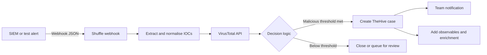

# SOC Automation with Shuffle, VirusTotal and TheHive

Build a repeatable SOAR workflow that receives a security alert, extracts indicators, enriches them through VirusTotal, applies transparent decision logic, creates a TheHive case for likely true positives, and notifies the response team.

## Architecture



## Portfolio outcomes

- API and webhook integration.
- Indicator parsing and normalisation.
- Secret handling through environment variables or platform secrets.
- Threat-intelligence enrichment.
- Explainable branching rather than black-box automation.
- Case creation, observables, tags, and responder notification.
- Testing, idempotency, rate-limit handling, and audit evidence.

## Phase 1 — Deploy and secure components

Deploy Shuffle and TheHive using their current official guidance. Use internal-only lab addresses or TLS-protected endpoints. Create dedicated least-privilege API users:

- Shuffle secret: `VT_API_KEY`
- Shuffle secret: `THEHIVE_API_KEY`
- Shuffle variable: `THEHIVE_URL`
- Notification webhook stored as a secret

Never put secrets into the workflow export, source code, screenshots, or Git history.

## Phase 2 — Alert contract

```json
{
  "alert_id": "LAB-2026-0001",
  "source": "wazuh",
  "title": "Suspicious outbound connection",
  "severity": "high",
  "timestamp": "2026-07-12T12:00:00Z",
  "host": "WS01",
  "user": "LAB\\alice",
  "indicators": [
    {"type": "domain", "value": "example.test"},
    {"type": "ip", "value": "203.0.113.50"},
    {"type": "sha256", "value": "synthetic-placeholder"}
  ]
}
```

Run [`scripts/send_test_alert.py`](./scripts/send_test_alert.py) against the Shuffle webhook using synthetic values.

## Phase 3 — Shuffle workflow

Import or recreate the logical blueprint in [`workflows/shuffle-workflow-blueprint.json`](./workflows/shuffle-workflow-blueprint.json).

Recommended nodes:

1. **Webhook trigger** — receives alert JSON.
2. **Validate schema** — reject missing `alert_id`, `title`, or `indicators`.
3. **Normalise indicators** — lowercase domains and hashes, remove duplicates, and validate IP syntax.
4. **For each indicator** — route to the correct VirusTotal endpoint.
5. **Aggregate results** — total malicious and suspicious engine counts.
6. **Decision** — calculate score and confidence.
7. **True-positive branch** — create TheHive case and observables.
8. **Review branch** — create a low-priority task or analyst queue item.
9. **Notify** — send a concise case link and reason.
10. **Audit output** — record alert ID, workflow execution ID, decision, and errors.

## Threat-intelligence decision logic

```text
malicious_score =
  3 × count(malicious engine verdicts)
+ 1 × count(suspicious engine verdicts)
+ 2 × known-phishing flag
+ 2 × high-confidence internal match

IF malicious_score >= 6 AND at least one indicator is valid:
    create TheHive case with severity 3
ELSE IF malicious_score >= 2:
    create analyst-review task
ELSE:
    annotate alert as no external reputation hit
```

Important:

- A zero VirusTotal detection count is not proof of safety.
- Do not automatically block an indicator based only on one vendor.
- Combine reputation, internal telemetry, context, prevalence, age, and analyst judgement.
- Cache results to control API usage and honour rate limits.
- Treat API errors as **unknown**, not benign.

## Phase 4 — TheHive case

Create a case with a consistent title, original alert summary, tags, mapped severity, start date, response tasks, and observables. Set TLP and PAP according to organisational handling policy.

Use `alert_id` as the idempotency key. Before creating a case, search TheHive for an existing case or custom field with that ID.

## Phase 5 — Notification

```text
High-confidence SOC case created
Case: LAB-2026-0001
Host: WS01
Reason: 2 indicators exceeded the enrichment threshold
Severity: High
Action: Review TheHive case and validate containment
```

Do not place full sensitive alert content in chat notifications.

## Failure handling

- VirusTotal 429: wait according to the response and retry with bounded exponential backoff.
- TheHive unavailable: queue the case payload and notify that orchestration failed.
- Invalid IOC: preserve it as analyst context but do not query it.
- Duplicate alert: update the existing case rather than creating noise.
- Partial enrichment: mark confidence as reduced.
- Notification failure: do not treat the incident workflow as fully successful.

## Validation checklist

- [ ] Webhook rejects malformed requests.
- [ ] Secrets are stored outside source control.
- [ ] Domain, IP, URL and hash routing works.
- [ ] VirusTotal errors do not become benign verdicts.
- [ ] Decision score is visible and explainable.
- [ ] Threshold branch creates a TheHive case.
- [ ] Observables and tasks are attached.
- [ ] Duplicate alert does not create a duplicate case.
- [ ] Notification contains no sensitive payload.
- [ ] Workflow execution is auditable.

## Interview narrative

“I connected a SIEM-style webhook to Shuffle, validated and normalised the payload, enriched each IOC through VirusTotal, and used an explainable scoring branch. High-confidence alerts created an idempotent TheHive case with observables and response tasks, followed by a minimal team notification. I also designed for rate limits, API failures, duplicates, secret management, and the risk of treating ‘no reputation hit’ as benign.”
