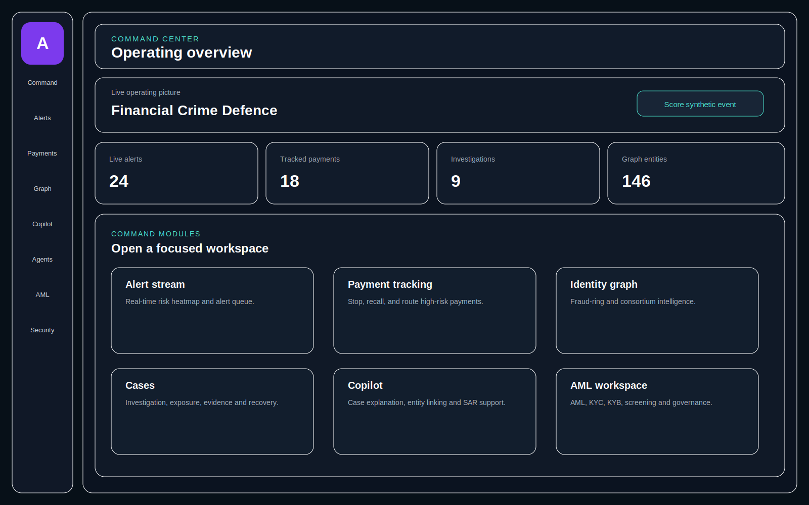

# A-Guard Visual Documentation

## Application interface

The visual follows the current operating-console source: dark full-screen layout, persistent navigation, top bar, Command Center / Operating Overview heading, metric strip, and focused workspace cards for alerts, payments, graph intelligence, cases, Copilot, agents, AML, learning, and security.

## UML diagrams

- [System architecture](uml/system-architecture.mmd)
- [Risk event sequence](uml/risk-event-sequence.mmd)

## Accuracy note

This is a source-aligned documentation visual rather than a browser screenshot. Live values depend on the API, WebSocket connection, fallback operating picture, and current application data.
